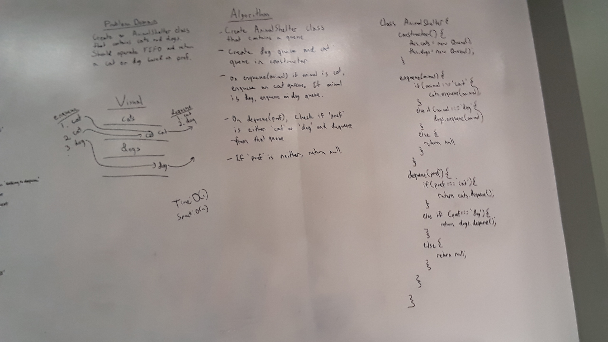

# Stacks and Queues
Javascript applications of stack and queue data structures

## Challenge
Using node objects, create stack and queue class objects that have the functionality to add nodes and to return them.

## Approach & Efficiency
#### Nodes
Both stack and queue use node objects that contain an input value and a variable to hold a reference to the next node.
#### Stack
The Stack class creates instances that contain a length value and a variable for referencing the top node in the stack.    
#### Queue
The Queue class creates instances that contain a length value and variables for referencing the front and rear of the queue.  

## API
#### Stacks
* `push(value)` -- A node can be pushed onto the stack by setting the new node's next to the top, then assigning the top as the new node.
* `pop()` -- A pop is performed by retreiving the top nodes value into a new variable, then assigning the top to be the next node.  The variable holding the old top node is then returned.
* `peek()` -- Returns the value of the top node, or null if it does not exist.
#### Queue
* `enqueue(value)` -- A node joins the queue by assigning the rear node as it's next, the assigning the new node as the rear.  If there's no front node, then the new node is assigned as both the front and the rear, as it would be the only node in the queue.
* `dequeue()` -- To dequeue a node, a tracking reference variable is assigned to the node in the rear.  It will then traverse through the queue until it arrives right behind the front node.  A results variable is assigned to the current node's next node's value.  The next node is then removed from the queue, and the current node is set as the new front of the queue.
* `peek()` -- Returns the value of the front node, or null if it does not exist.

# Animal Shelter

## Challenge
Create an AnimalShelter class that can take in cats or dogs with an enqueue method, and return either a cat or dog depending on preference with a dequeue method.

## Approach & Efficiency
This class implements two `Queue` class objects, one for dogs and one for cats.  When `enqueue` is called with the argument 'cat', a cat is added to the cats queue.  When `enqueue` is called with the argument 'dog'. a dog is added to the dogs queue.  When `dequeue` is called with the argument of 'cat' or 'dog', one animal will be dequeued from the corresponding queue.  If no arguments are passed to either `enqueue` or `dequeue`, null will be returned.

## Whiteboard

