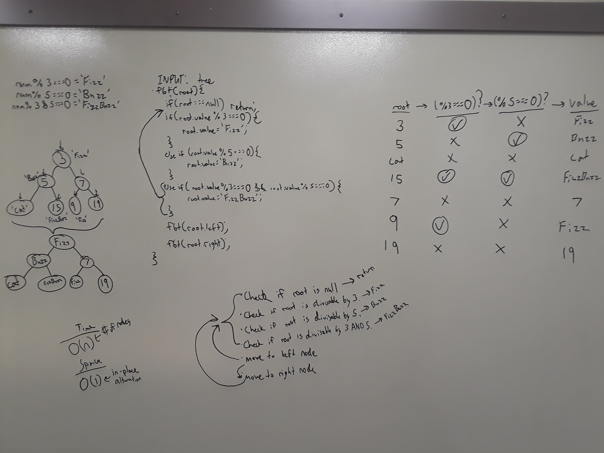
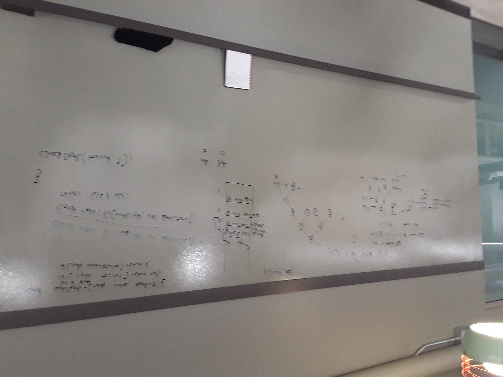
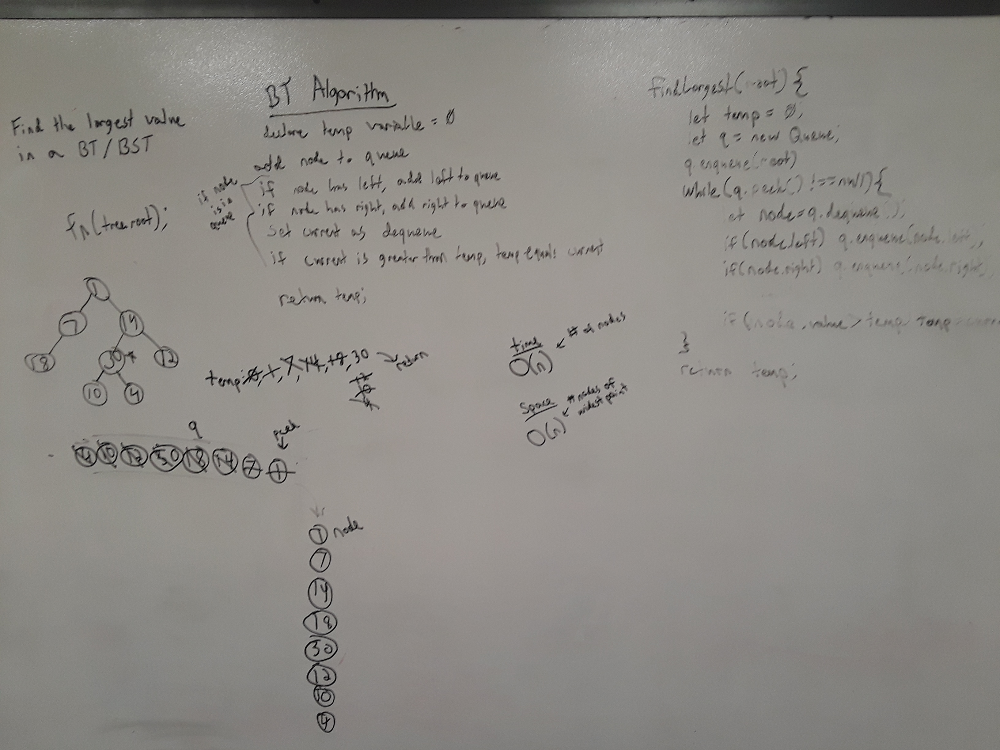

# Trees
Javascript implementations of binary tree and binary search tree data structures

## Challenge
Using node objects, create tree class objects that have the functionality sort the containing values, add values, and search for a given value.

## Approach & Efficiency
Both `tree.js` and `binary-search-tree.js` make use of Node class objects that have variables to reference a value, a left node, and a right node.  The Tree class objects have a constructor that build a tree with a root node of a given value.

Depth-first traversals are performed recursivly and make use of an array to hold the values.  For the binary search tree, integer values are added recursivly as well, with lower values going to the left and higher values going to the right.  After each check the recursion will move the current node to the respective lower node.  The `contains(value)` function will perform a traversal and check weach node's value, and if found will return a boolean true, otherwise a boolean false is returned.

# FizzBuzz
A function that replaces certain numbers with strings

## Challenge Description
Given a binary tree, traverse the tree and replace all numbers divisible by 3 with 'Fizz', numbers divisible by 5 with 'Buzz', and numbers divisible by 3 and 5 with 'FizzBuzz'.

## Approach & Efficiency
The function uses a preOrder recursive function to traverse the tree and checks for a mod (%) of 0 to replace the numbers. 

## Solution

# FindDepth
A function that when given a tree and a value, finds the depth of the node with that value, or returns null

## Challenge Description
This function uses recursion and the callstack to traverse a tree and return the depth of the node with the given value.  The base case for this function is to return null if the node is null, then to return the depth if the node's value matches the search value.

If the base case is not fulfilled, the function will declare a variable for the left node and call itself on that node and add one to the depth, which is held in a third parameter of the function.  This repeats for the right node if there is no node to the left.  At the end of the traversal, the left and right variables will both be null, or one of them will contain the depth of the value if it is found.  If found, that value will be returned, otherwise null will be returned.

## Approach & Efficiency
The function uses a preOrder recursive function to traverse the tree and check every node until the value is found, leading to a worst case time complexity of O(n).  The function calls are stored in the callstack which leads to a space complexity of O(h), where h is the height to the deepest node in the tree.

## Solution

# findMax

## Challenge Description
Given a tree, find the maximum value in the tree and return it.

## Approach & Efficiency
This function uses a queue to perform a breadth-first traversal, and checks each node's value as they're dequeued from the queue.  If the value is larger than any value it's seen so far, it is saved to a temporary variable.  After traversing the whole tree, the value of the temporary variable will be the largest in the tree and can be returned.
The time complexity of this function is O(n) because it needs to check every node's value.  The space complexity is O(n) where n is the number of nodes in the widest level of the tree.  That is the maximum number of nodes that will be in the queue at any given time.

## Solution
